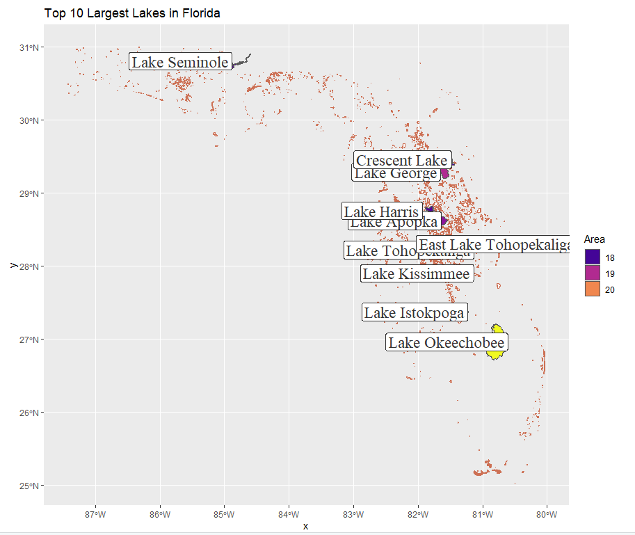
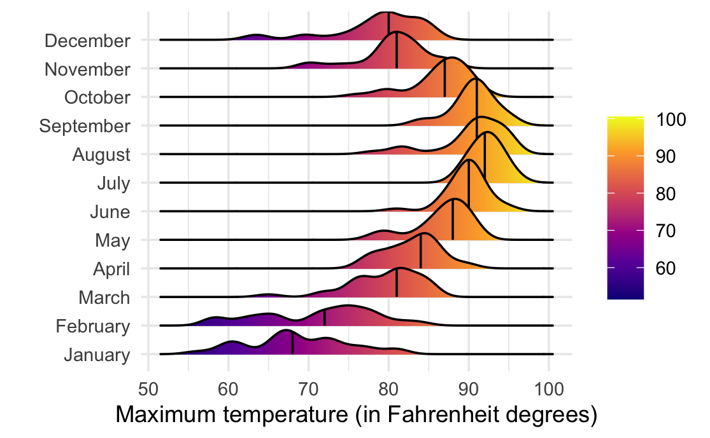

# Data Visualization and Reproducible Research

> Mohammad Juma. 

Learn more about me in my [GitHub profile page](https://github.com/mjumma77). 

The following is a sample of products created during the _"Data Visualization and Reproducible Research"_ course.

## Project 01

In the `project_01/` folder you can find... _[Analysis on a fuel data set]_
Find the code and report in the `project_01/Report' folder.
### Details of Project 01.
Data Set: fuel.csv
source :1984-2017 fuel economy data produced during vehicle testing at the (EPA) National Vehicle and Fuel Emissions Laboratory.

The project is divided on high level two three parts:
- Data Summary: getting familiar with the data and understand the structure and identify any missing values.
- Data Preparation: Create new variables, remove missing values, and subset the data
- Data Visualization; Three visualization are produced
    - A Visualization exploring the effect of Engine Displacement in liters and the car type on the mile per galon metric
    - A Visualization exploring the evolution of EV car range over time and the dominant car type for EV cars
    - A Visualization comparing the money saving for EV vs Fossil fuel cars
## Sample Visualization

## Project 02

In this project, I explored ... _[Exploration of three types of visualization: Spatial, Interactive, and Model Based]_ 
Find the code and report in the `project_02/Report' folder.
### Details of prject 02:
Data Sets:
- Florida Lakes: a shapes file containing geometrical information on all lakes in the stat of Florida
- West Roxbury: a data set on houses in West Roxbury, MA. This set contains all information of the interior and the exterior details of the houses.
The project is divided on high level two three parts:
- Data Summary: getting familiar with the data and understand the structure and identify any missing values.
- Data Preparation: Create new variables when needed, remove missing values, and subset the data
- Data Visualization; Three visualization are produced
    - Spatial Visualization: a Map of Florida lakes highlighting the top 10 largest lakes.
    - Model Based Visualization: a plot of linear regression prediction on house values baesd on given parameters such as # of rooms and floors. 
    - An Interactive Dashboard: a Dashboard of a selected subsets of the Roxbury is created. The data is subsetted based on the following logic:
          - General Plot: a plot that shows the overall trend of the house values
          - High-value Houses Plot: a Plot of the top 25% pf the houses in the set
          - Lower-value Houses: a plot of the lower 25% of the houses
          - Old Houses: a plot of the oldest houses in the set
          
Final note: Because the last visualization is a dashboard, it will be created in a separate markdown file.
## Sample Visualization:

## Project 03

In this project, I explored ... _[The reproducibility of selected visualization bt Dr. Sanchez]_
### Details of prject 03:
Data Sets:
- Tampa Weather: a data set containing the recorded temperatures and precipitation for every day in 2022
- Concrete Strength: Data on concrete strength in relation to Age (measured in days) and ingredients.
Visualizations:
Number of visualization are generated exploring the distribution of temperatures vs months and Concrete Strength against Age
and other ingredients such as water.
## Sample Visualization:

### Moving Forward

This class, though demanding, has really opened my eyes to many design principles. I can't say that I have followed all but it definitely improved my visuals.
I intend on improving my skills and fine tune my artistic sense if I ever have one :)
